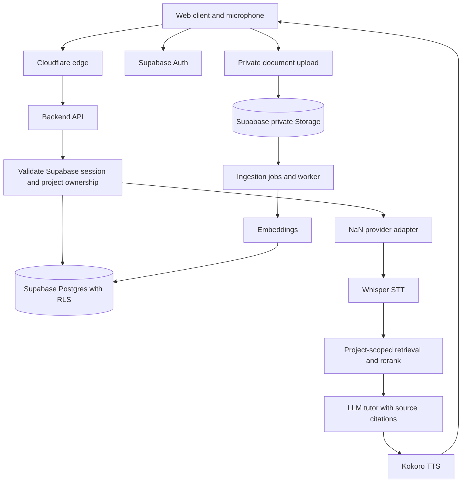

# Learn Anything

A voice-first learning platform for any topic. Create a private learning project, set a goal, upload your own learning material, and practise with an AI tutor. Language practice and concept learning share the same project, document and conversation foundation.

**Status:** planning backlog, not a running application. Repository visibility and license are publication decisions to confirm. Proposed release: v0.1.

## v0.1 outcome

One learner can sign in, create a project, upload PDF/Markdown/plain text, wait for ingestion, and have a spoken conversation grounded in that project's documents. The interface displays transcripts and source citations. The tutor adapts to a language-practice or concept-learning mode. A second user cannot access the first user's projects, documents, conversations or provider credentials.

Voice is a core feature, not an optional text chatbot. The first implementation is a measured, turn-based microphone conversation: record a short turn, transcribe it, generate a grounded response, synthesise speech, and play it. Continuous conversation, voice activity detection and interruption are later enhancements. Current provider docs do not establish a realtime duplex speech API; no such claim is made here.

## Proposed architecture

- Web client: TypeScript, accessible responsive UI. Framework choice is resolved in the architecture issue before scaffold work.
- Supabase: Postgres, Auth, private Storage and tenant-scoped vector retrieval. Versioned SQL migrations and RLS are required.
- Cloudflare: web/API hosting and an optional Access gate for restricted deployments. Supabase Auth remains the identity and row-authorization authority. Access JWT validation is a separate perimeter control, not a replacement for Supabase sessions or RLS.
- Backend API: validates Supabase sessions, scopes every operation to a user and project, and calls providers without exposing keys.
- Ingestion worker: parses documents, creates source-aware chunks, requests embeddings, and commits resumable job results. A worker runtime is chosen after validating file size and execution-time limits.
- NaN Builders adapter: OpenAI-compatible LLM calls, Whisper transcription, Whisper audio translation to English, Kokoro speech, Qwen3 embeddings and reranking. Model IDs and supported languages are configuration, checked against current provider capabilities.

Voice flow: **microphone -> STT -> scoped RAG -> LLM tutor -> TTS -> playback**. Transcripts are visible and editable before retry. Translation is explicit, not applied silently. Whisper's translation endpoint outputs English, so arbitrary translation between language pairs requires a separately tested LLM task.

## Project and data boundaries

Proposed entities: projects, documents, ingestion_jobs, document_chunks, learning_sessions, messages, citations, learning_goals and progress_events. Every content row is scoped to its owner and project. Original documents, chunks, embeddings and messages remain private even when the source code is public. Storage policies follow the same owner/project boundary.

Uploads are restricted by type and size, parsed safely, and never interpreted as system instructions. Documents can be deleted with their chunks and citations handled explicitly. Raw voice audio is ephemeral by default; retaining it requires opt-in and a retention policy. Do not promise pronunciation scoring from transcripts alone.

## Provider credentials and deployment gate

NaN's terms say API keys are personal and non-transferable and must not be shared, resold or transferred. A deployment must not pool one person's membership key for other users. The first target is self-hosted/single-user with the deployer's own server-side key. Hosted multiuser provider access is blocked until vendor-approved terms and a secure credential model are documented. Bringing a key is a possible design, not proof that third-party key custody is allowed.

No provider requests should be made during ordinary CI. Tests use synthetic fixtures and mocks. Live smoke tests are opt-in and use privately configured secrets.

## Vector compatibility gate

NaN documents `qwen3-embedding` as returning 4096-dimensional vectors. Supabase's HNSW documentation lists index limits of 2000 dimensions for `vector` and 4000 for `halfvec`. A naive 4096-dimensional HNSW index will not satisfy that contract. Start with a small-corpus exact-search proof of concept and choose an evaluated strategy before claiming scalable retrieval. Possible strategies include provider-supported reduced dimensions, binary-quantized candidate search followed by full-vector reranking, or a separately approved embedding model. Never silently truncate embeddings.

## Security

**No secrets in this repo.** No API keys, service-role credentials, production URLs containing credentials, private documents, recordings, personal data or account exports. Commit only synthetic fixtures and empty/example configuration values.

- Supabase publishable/anon keys are not the authorization boundary; enforce RLS.
- Supabase service-role credentials and NaN keys stay server-side.
- Validate both identity layers when Access is enabled; reject forged/expired tokens and direct-origin bypass.
- Rate-limit costly routes, cap uploads and audio duration, redact logs and prevent cross-tenant caches.
- Defer provider data processing and multiuser deployment until privacy/retention terms are reviewed.
- Secret scanning, dependency checks and deterministic tests gate pull requests.

## Development factory contract

Each issue has a stable planning ID, scope, exclusions, acceptance criteria, test evidence and explicit prerequisites. Agents must complete prerequisites before starting blocked work. One issue per pull request; reference the issue, include test commands/results, and do not add live credentials. No external resource creation or paid deployment is authorized by an issue alone.

See `BACKLOG.md` for proposed epics and executable stories. Proposed milestone: **v0.1 - private projects and grounded voice learning**. Epic issues close only after their child acceptance criteria and end-to-end tests pass.

## Scope exclusions

No implementation or cloud resources are provisioned by this planning package. v0.1 excludes billing, shared/team projects, public document galleries, mobile-native apps, autonomous browsing, external action tools, high-stakes professional advice and validated pronunciation scoring. It does not include the user's later development pipeline.

## Verified documentation

Checked 2026-10-02. Provider capabilities and terms must be rechecked when implementing.

- NaN API examples: https://nan.builders/docs/examples
- NaN model limits: https://nan.builders/docs/models
- NaN terms: https://nan.builders/terms
- Supabase Auth: https://supabase.com/docs/guides/auth/server-side
- Supabase RLS: https://supabase.com/docs/guides/database/postgres/row-level-security
- Supabase Storage security: https://supabase.com/docs/guides/storage/security/access-control
- Supabase pgvector: https://supabase.com/docs/guides/database/extensions/pgvector
- Supabase HNSW limits: https://supabase.com/docs/guides/ai/vector-indexes/hnsw-indexes
- Cloudflare Access validation: https://developers.cloudflare.com/cloudflare-one/access-controls/applications/http-apps/authorization-cookie/validating-json/
