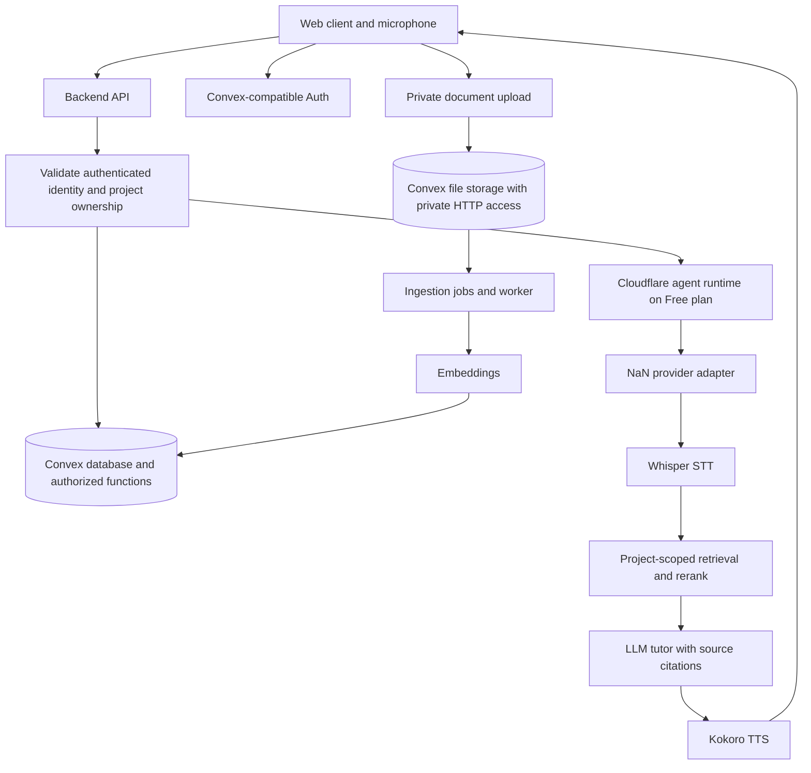

# Learn Anything

A voice-first learning platform for any topic. Create a private learning project, set a goal, upload your own learning material, and practise with an AI tutor. Language practice and concept learning share the same project, document and conversation foundation.

**Status:** planning backlog, not a running application. Public source code under MIT. Proposed release: v0.1.

## v0.1 outcome

One learner can sign in, create a project, upload PDF/Markdown/plain text, wait for ingestion, and have a spoken conversation grounded in that project's documents. The interface displays transcripts and source citations. The tutor adapts to a language-practice or concept-learning mode. A second user cannot access the first user's projects, documents, conversations or provider credentials.

Voice is a core feature, not an optional text chatbot. The first implementation is a measured, turn-based microphone conversation: record a short turn, transcribe it, generate a grounded response, synthesise speech, and play it. Continuous conversation, voice activity detection and interruption are later enhancements. Current provider docs do not establish a realtime duplex speech API; no such claim is made here.

## Proposed architecture

- Web client: TypeScript, accessible responsive UI, React SPA built with Vite (ADR-0001), hosted as a static build on Vercel Hobby (ADR-0002). The repository carries `packages/app/vercel.json` — the honoured config location for this project — with output directory `dist` (→ `packages/app/dist`) and the security-header set including the microphone permission policy; framework preset, install/build commands and the Node version are Vercel project settings (owner authority), documented as observed in `docs/deployment-runbook.md` section 13.1: install `pnpm install`, build `pnpm run build`, Node 24.x (2026-10-03 build logs). A repository-root `vercel.json` was proven not authoritative by three preview deployments (§13.1), and the root `engines.node` (`>=22`, CI on 22.14.0) is the workspace requirement that does not select the Vercel build Node.
- Convex: reactive document database, typed queries/mutations/actions, file storage and project-filtered vector search. Authorization is enforced in every public function, not database RLS. Versioned schema/functions and resumable data migrations replace SQL migrations.
- Authentication: start with Convex-compatible auth without a paid auth SaaS requirement. Convex Auth is beta; OAuth GitHub/Google is the initial candidate after configuration review. Email OTP/reset requires an email provider. The auth/runtime ADR selects the method and validates agent-token bridging.
- Cloudflare: agent runtime only, using Agents SDK on Workers and SQLite-backed Durable Objects within the Workers Free plan limits. No Cloudflare Access authentication gate and no general web hosting in this scope. Convex-compatible authentication remains the identity authority. Frontend hosting is Vercel (ADR-0002), never Cloudflare. Free limits are finite: quota exhaustion must fail safely, not trigger a paid upgrade.
- Backend API: validates Convex-compatible authenticated identity, scopes every operation to a user and project, and calls providers without exposing keys.
- Ingestion worker: parses documents, creates source-aware chunks, requests embeddings, and commits resumable job results. A worker runtime is chosen after validating file size and execution-time limits.
- NaN Builders is the default provider for every documented AI stage: LLM tutor and text translation, Whisper STT and audio-to-English translation, Kokoro TTS, qwen3-embedding embeddings, and rerank. Reuse embeddings and rerank retrieved candidates to make full use of the membership within its published quotas. No silent fallback to another provider; unsupported capabilities require a visible decision. Model IDs, voices, languages and limits are checked during implementation.

Voice flow: **microphone -> STT -> scoped RAG -> LLM tutor -> TTS -> playback**. Transcripts are visible and editable before retry. Translation is explicit, never applied silently: the learner chooses one of three actions — transcribe the speech, translate the audio to English, or translate text they already have into a selected target language — and a translation always appears next to the original text, which is never replaced. Whisper's translation endpoint outputs English only, so audio translation to any other target is refused with an actionable fallback to text translation instead of silently returning English; translation between language pairs is the separately tested LLM task, whose source text is sent as data rather than instructions.

## Hosting boundary: Vercel hosts the web client, Convex the backend, Cloudflare the agents

Recorded in ADR-0002 (amended by issue #38) and configured in this repository:

| Surface | Hosts it | Configured in this repository | Never |
| --- | --- | --- | --- |
| Web client (static Vite build of `packages/app`) | **Vercel, Hobby/free tier** | `packages/app/vercel.json`: output directory `dist` (→ `packages/app/dist`) + security headers — the honoured location, established by three preview deployments (runbook section 13.1; a repository-root `vercel.json` is not authoritative). Framework preset, install (`pnpm install`), build (`pnpm run build`), Root Directory and Node version (24.x) are Vercel project settings, documented from the working production build | No secrets, no server code, no provider keys |
| Durable data, auth, ingestion, HTTP actions | **Convex** (Free plan) | `docs/convex-development.md`, `docs/deployment-runbook.md` sections 2-5 | Never auto-upgrades to a paid plan |
| Learner agents | **Cloudflare Workers Free** | `packages/agent/wrangler.json` | No frontend hosting, no Access gate, no paid plan |

Security headers for the Vercel-hosted frontend (all in `packages/app/vercel.json`, runbook section 13.2): `Strict-Transport-Security`, `X-Content-Type-Options: nosniff`, `Referrer-Policy: strict-origin-when-cross-origin`, `X-Frame-Options: DENY`, `Permissions-Policy: microphone=(self)` for the voice UI, and a `Content-Security-Policy` verified against the built bundle (no `eval`, no inline script/style, `connect-src` limited to `'self'` plus the Convex platform origins). Production QA on 2026-10-03 found HSTS but none of the other headers on the live alias, so these entries are the fix — **they take effect only on the next Vercel deployment (owner authority)**.

Environment variables are documented by name only. The browser build reads public `VITE_CONVEX_URL` and optional `VITE_CONVEX_SITE_URL`, supplied per environment in the Vercel project settings at build time; NaN keys, `JWT_PRIVATE_KEY`/`JWKS`, deployment coordinates and every other server value exist only in Convex environment variables (or the Worker secret store) and never in this repository or the client bundle — `docs/deployment-runbook.md` section 7 records the `grep` proof against `dist/`.

Auth redirect/CORS allowlist entries stay exact-match, no wildcards: production origin `https://app-dun-seven-88.vercel.app` must be `SITE_URL` on the production Convex deployment with its hash routes in `AUTH_REDIRECT_URIS` (runbook section 13.5); per-deployment preview URLs are Vercel-auth-protected and are added one exact origin at a time to a preview/staging deployment only.

Rollback/redeploy steps and Vercel Hobby free-tier limits are documented in `docs/deployment-runbook.md` sections 13.6 and 13.7. Deploying this configuration, the Convex auth secrets workflow (`JWT_PRIVATE_KEY`/`JWKS`) and the live preview/production smoke remain blocked pending owner authority (issue #38).

## Project and data boundaries

Proposed entities: projects, documents, ingestion_jobs, document_chunks, learning_sessions, messages, citations, learning_goals and progress_events. Every content row is scoped to its owner and project. Original documents, chunks, embeddings and messages remain private even when the source code is public. All public Convex functions and HTTP file actions enforce the same owner/project boundary. File IDs do not grant access.

Uploads are restricted by type and size, parsed safely, and never interpreted as system instructions. v0.1 uses authenticated HTTP upload/download actions and a <=10 MiB file cap below Convex's 20 MB HTTP limit. `storage.getUrl()` is a bearer link, not an authenticated expiring link; do not expose it for private documents or audio. Documents can be deleted with their chunks and citations handled explicitly. Raw voice audio is ephemeral by default; retaining it requires opt-in and a retention policy. Do not promise pronunciation scoring from transcripts alone.

## Provider credentials and deployment gate

NaN's terms say API keys are personal and non-transferable and must not be shared, resold or transferred. A deployment must not pool one person's membership key for other users. The first target is self-hosted/single-user with the deployer's own server-side key. Hosted multiuser provider access is blocked until vendor-approved terms and a secure credential model are documented. Bringing a key is a possible design, not proof that third-party key custody is allowed.

No provider requests should be made during ordinary CI. Tests use synthetic fixtures and mocks. Live smoke tests are opt-in and use privately configured secrets.

## Vector compatibility and Free-plan gates

NaN documents `qwen3-embedding` as 4096-dimensional. Convex's current vector-search guide and platform limits permit 2-4096 dimensions, but its generated `VectorIndexConfig` API reference still says 2-2048. Verified by the S12 capability spike on 2026-10-03 with the pinned `convex@1.43.0` SDK against the free development deployment: a 4096-dimension index was created and a real query returned ranked results, so the platform enforces the guide's 2-4096 range and the API-reference note is stale documentation. Do not truncate vectors or change provider silently. Use owner/project filter fields before retrieval, recheck ownership of returned IDs, and apply NaN rerank to candidates.

Convex vector search runs in actions, not queries, and uses fixed-length `v.array(v.float64())` vectors. Each search charges the whole index size in query-GB, regardless of tenant filters or number of results. Filters protect scope, not per-tenant billing isolation.

Convex Free is distinct from metered Starter. Checked limits include database 0.5 GB, database I/O 1 GB/month, file storage 1 GB, data egress 1 GB/month, search storage 0.5 GB, search queries 3000 query-GB/month and 1 million function calls/month. Limits and actual plan must be rechecked at deployment. Free exhaustion can cause failures; never enable a paid upgrade automatically. Cloudflare agent Free quotas are separate.

Cloudflare agent state is session/runtime state only; Convex owns durable projects, documents, messages and progress. The bridge must validate the selected auth provider's JWT/OIDC contract or a short-lived scoped server-issued connection token. Never assume a browser user ID or email authenticates an agent, or that Convex Auth tokens are accepted automatically by Cloudflare.

## Deployment and recovery

`docs/deployment-runbook.md` is the operator procedure for the agent-only Cloudflare Free + Convex deployment: per-environment (dev/staging/prod) configuration and Convex Auth callback allowlists, where every key in `.env.example` lives per environment and how to prove no secret reached a client asset, Convex Free vs metered Starter quotas with usage alerts and the no-billing-upgrade guard, Workers Free/SQLite Durable Object limits, versioned schema migrations and worker retries, the health-check gate that blocks a failed release, backup/restore/rollback limits, recovery procedures, and the ordered single-user-before-multiuser preflight. The Vercel web client has its own section (section 13): `packages/app/vercel.json` shape and the empirical config-location findings, security headers and microphone policy, exact preview/production origins for the auth allowlist, frontend rollback/redeploy, and Hobby free-tier limits. Dry-run and config validation with fake values live in its section 7; no provisioning, secret insertion or live provider call is authorized by that document.

## Security

**No secrets in this repo.** No API keys, deployment-admin credentials, production URLs containing credentials, private documents, recordings, personal data or account exports. Commit only synthetic fixtures and empty/example configuration values.

- Every public query, mutation, action and file HTTP action checks authenticated identity and project ownership.
- `storage.getUrl()` is bearer access, not an authenticated private-document link: private document/audio bytes are served only by the authenticated `/private-files/:fileId` HTTP action after owner and project checks. Cache keys must begin with the authenticated owner and project (for example `ownerId:projectId:resource`); S12/S13 vector search must filter by both fields before retrieval and recheck every returned record's owner/project before use.
- Convex deployment-admin credentials and NaN keys stay server-side; no admin client in browser.
- Validate Convex identity and project ownership at agent entry points and on reconnect; clients cannot pick another learner's agent instance or read another project's state.
- Rate-limit costly routes, cap uploads and audio duration, redact logs and prevent cross-tenant caches.
- Defer provider data processing and multiuser deployment until privacy/retention terms are reviewed; the known/unknown/agreement split is recorded in `docs/provider-data-handling.md`.
- Every response from the Vercel-hosted frontend carries the `packages/app/vercel.json` header set: CSP, `Permissions-Policy: microphone=(self)`, `X-Content-Type-Options: nosniff`, `Referrer-Policy`, `X-Frame-Options: DENY`/`frame-ancestors 'none'` and HSTS. They are configuration only and take effect on the next deployment (owner authority); the Convex/Cloudflare surfaces keep their own authenticated boundaries.
- Secret scanning, dependency checks and deterministic tests gate pull requests.

## Development factory contract

Each issue has a stable planning ID, scope, exclusions, acceptance criteria, test evidence and explicit prerequisites. Agents must complete prerequisites before starting blocked work. One issue per pull request; reference the issue, include test commands/results, and do not add live credentials. No external resource creation or paid deployment is authorized by an issue alone.

See `BACKLOG.md` for proposed epics and executable stories. Proposed milestone: **v0.1 - private projects and grounded voice learning**. Epic issues close only after their child acceptance criteria and end-to-end tests pass.

## Scope exclusions

No implementation or cloud resources are provisioned by this planning package. v0.1 excludes billing, shared/team projects, public document galleries, mobile-native apps, autonomous browsing, external action tools, high-stakes professional advice and validated pronunciation scoring. It does not include the user's later development pipeline.

## Verified documentation

Checked 2026-10-02; Vercel hosting sources added 2026-10-03 (issue #38). Recheck versions, capabilities, quotas and terms during implementation.

- NaN API examples: https://nan.builders/docs/examples
- NaN model limits: https://nan.builders/docs/models
- NaN terms: https://nan.builders/terms
- Convex authentication: https://docs.convex.dev/auth/overview
- Convex Auth beta and methods: https://labs.convex.dev/auth
- Convex auth setup choices: https://labs.convex.dev/auth/config
- Convex file uploads: https://docs.convex.dev/file-storage/upload-files
- Convex private file serving: https://docs.convex.dev/file-storage/serve-files
- Convex vector search: https://docs.convex.dev/search/vector-search
- Convex generated vector API reference (conflicting dimensional limit): https://docs.convex.dev/api/interfaces/server.VectorIndexConfig
- Convex platform limits: https://docs.convex.dev/production/state/limits
- Convex plans: https://www.convex.dev/pricing
- Cloudflare Agents SDK: https://developers.cloudflare.com/agents/
- Cloudflare Durable Objects Free plan: https://developers.cloudflare.com/durable-objects/platform/pricing/
- Cloudflare Workers limits: https://developers.cloudflare.com/workers/platform/limits/
- Vercel `vercel.json` project configuration: https://vercel.com/docs/project-configuration/vercel-json
- Vercel `vercel.json` JSON schema (referenced by `$schema`): https://openapi.vercel.sh/vercel.json
- Vercel supported Node.js versions (`engines.node` override): https://vercel.com/docs/functions/runtimes/node-js/node-js-versions
- Vercel plan limits: https://vercel.com/docs/limits
- Vercel fair use guidelines and Hobby monthly allowances: https://vercel.com/docs/limits/fair-use-guidelines
